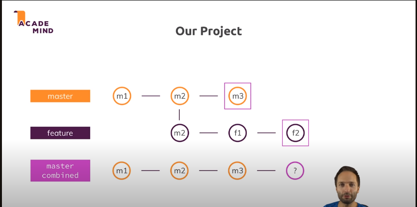

- This document follows this video:
    - https://www.youtube.com/watch?v=CRlGDDprdOQ

- Scenario
    - 
    - there are two ways to merge the `feature` branch into the `master` branch
        - merge
        - rebase

- if we are in master and we want to merge the feature branch into master
    - `git merge feature`
    - if we give
        - `git merge --squash feature`
            - this will merge the feature branch into master but it will not create a commit for the merge
- lets learn about rebase
    - `git rebase feature`
        - this will rebase the feature branch onto master
        - that is master branch latest commit will be the base for the feature branch
