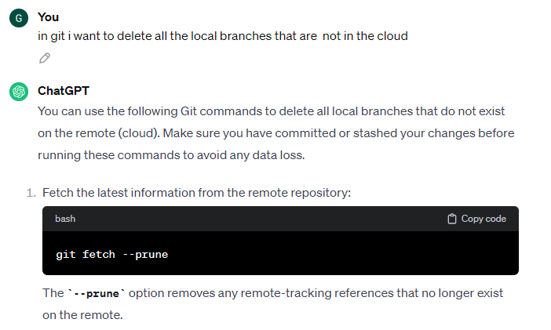

# How to delete all the branches in local , that are deleted in the cloud

-  
- 
- `git fetch -p` or `git fetch --prune` will fetch all the branches from the remote repository and delete all the branches that have been deleted on the remote repository
- `git branch -vv | grep ': gone]' | awk '{print $1}' | xargs -r git branch -d`